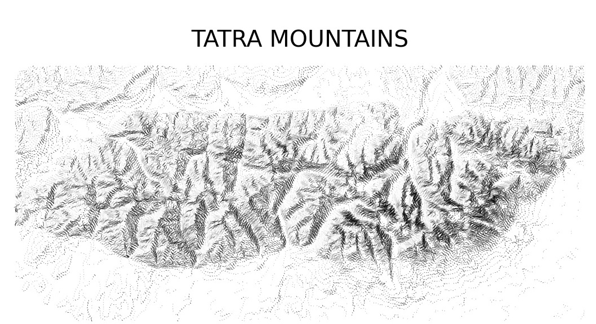

Automating processing of Lehmanns hachures for any requested island on the planet

You need to provide free opentopography.com API key and put it into the code.

<<<<<<< HEAD
Just set the environment, type islands name and run a notebook
=======

[Code with whole procedure is here](Lehmanns_Shrafure.ipynb)  
<link>

Several parameters:  
- number of contours,  
- distance between sampling points on contours 
- multiplier factor (each line length is calculated based on a slope at point, multiplied by the multiplier factor)
 should be manually adjusted to fit the terrain and relief characteristics

Final map for the Tatra mountains area looks like this (EU DEM used):

>>>>>>> parent of 98decfa... partial plots fixed

